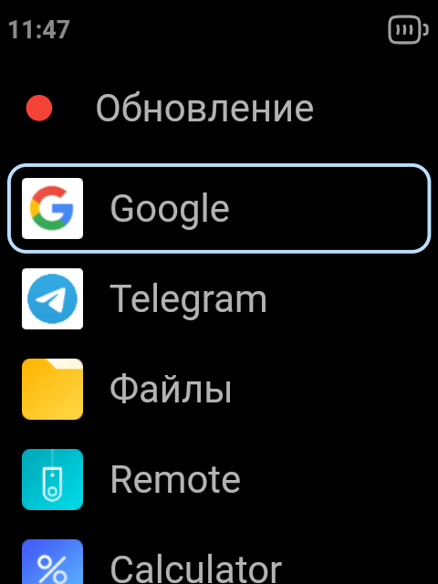

# QIN Launcher1

Launcher for Qin Phones

### Download

[Releases](https://github.com/MrJohnDev/qin_launcher1/releases/latest)

### Screenshots

&nbsp;&nbsp;&nbsp;&nbsp;&nbsp;&nbsp;&nbsp;&nbsp;&nbsp;

### Features

Long Press `2` in menu for All Apps List  
Long Press `9` in menu for User Apps List
